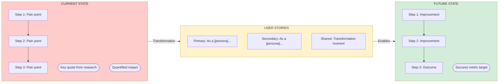

# PRD Writer Skill

Specialized knowledge for generating structured PRDs that align with AskElephant's product vision.

## When to Use

- Creating new PRDs
- Updating existing requirements
- Reviewing PRD drafts
- Defining feature scope

## Before Writing: Strategic Alignment Check

**CRITICAL**: Before drafting ANY PRD:

1. Read `pm-workspace-docs/company-context/product-vision.md`
2. Read `pm-workspace-docs/company-context/strategic-guardrails.md`
3. Check `pm-workspace-docs/company-context/personas.md`
4. Look for related PRDs in `pm-workspace-docs/initiatives/`

## Pushback Triggers

Stop and ask clarifying questions if you detect:

### 🚩 Unclear Outcomes

- "What business outcome does this enable?"
- "How would we know if this is working?"

### 🚩 Missing Persona Context

- "Which persona needs this—reps, leaders, CSMs, or RevOps?"
- "What's their current pain?"

### 🚩 No Evidence

- "What evidence suggests customers need this?"
- "If we didn't build this, what happens?"

### 🚩 Revenue Impact Unclear

- "How does this help land, expand, or retain?"
- "Does this help win deals we're losing?"

### 🚩 Trust/Privacy Implications

- "How does this interact with privacy?"
- "What happens when this fails?"

### 🚩 Anti-Vision Warning

- "This sounds like generic AI notes—how is this uniquely AskElephant?"

## Outcome Chain Requirement

Every PRD MUST include:

```
[Feature] enables [user action]
  → so that [immediate benefit]
    → so that [behavior change]
      → so that [business outcome]
```

**If the chain cannot be articulated, do not proceed with PRD. Recommend discovery.**

## PRD Structure

```markdown
# [Feature Name] PRD

## Overview

- **Owner:**
- **Target Release:**
- **Status:** Draft
- **Strategic Pillar:** [Trust / Data Knowledge / Trend Visibility]

## Outcome Chain

[Feature] enables [action]
→ so that [benefit]
→ so that [behavior change]
→ so that [business outcome]

## Problem Statement

What problem? Who has it? Why now? What evidence?

### Evidence

- [ ] User quotes
- [ ] Churn/support data
- [ ] Competitive pressure

## Goals & Non-Goals

### Goals (Measurable)

- [ ] Goal with success metric

### Non-Goals

- Explicit exclusion with reasoning

## User Personas

### Primary: [Name]

- **Job-to-be-done:**
- **Current pain:**
- **Success looks like:**
- **Trust factors:**

### Secondary: [Name]

- **Job-to-be-done:**
- **Current pain:**
- **Success looks like:**
- **Trust factors:**

### Tertiary: [Name] (if applicable)

- **Job-to-be-done:**
- **Current pain:**
- **Success looks like:**
- **Trust factors:**

## User Stories (Per Persona - REQUIRED)

**CRITICAL:** Create explicit user stories for EACH persona defined above. These feed into FigJam diagram generation.

### Primary Persona Stories

- As a [Primary Persona], I want [action] so that [benefit]
- As a [Primary Persona], I want [action] so that [benefit]

### Secondary Persona Stories

- As a [Secondary Persona], I want [action] so that [benefit]

### Tertiary Persona Stories (if applicable)

- As a [Tertiary Persona], I want [action] so that [benefit]

## Shared Customer Journey

**REQUIRED:** Define the shared journey that applies across personas.

### Current State (Pain Points)

1. Step 1 → Pain point
2. Step 2 → Pain point
3. Step 3 → Pain point

### Future State (With Feature)

1. Step 1 → Improvement
2. Step 2 → Improvement
3. Step 3 → Improvement

### Transformation Moment

What is the key "aha moment" when users realize the value?

## Requirements

### Must Have (MVP)

### Should Have

### Could Have

## User Flows

### Flow: [Name]

**Trigger:**
**Steps:** 1 → 2 → 3
**Outcome:**
**Error states:**
**Trust recovery:**

## Trust & Privacy Considerations

## Success Metrics

- **North star:**
- **Leading indicators:**
- **Guardrails:**

## Strategic Alignment

- [ ] Outcome chain complete
- [ ] Persona validated
- [ ] Trust implications assessed
- [ ] Not in anti-vision territory

## Open Questions
```

## Save Location

`pm-workspace-docs/initiatives/[kebab-case-name]/prd.md`

## When to Refuse

If initiative fails strategic guardrails:

1. List gaps/concerns clearly
2. Recommend specific discovery work
3. Suggest questions to answer first
4. Offer to help with discovery instead

## FigJam Customer Story Generation (REQUIRED)

After completing the PRD, **generate a FigJam diagram** that visualizes the customer story.

### When to Generate

- After PRD is complete with user stories and shared journey
- Before prototype begins (can be done during `/pm` command)

### FigJam Content Requirements

The diagram should include:

1. **Current State (Pain)** - The painful user journey with key quotes
2. **User Stories by Persona** - Each persona's primary user story
3. **Future State (Solution)** - The improved journey with the feature
4. **Outcome Chain** - Business impact flow

### MCP Tool Call

Use the Figma MCP `generate_diagram` tool:

```
Server: user-Figma
Tool: generate_diagram
Arguments:
  - name: "[Initiative Name] - Customer Story"
  - mermaidSyntax: [Generated flowchart - see template below]
  - userIntent: "Visualize the customer problem and user stories for [initiative]"
```

### Mermaid Template



### Save FigJam URL

After generating, save the FigJam URL to `_meta.json`:

```json
{
  "figjam_url": "https://www.figma.com/...",
  "figjam_generated": "2026-01-28"
}
```

This URL will be included in prototype notifications sent via Slack.
