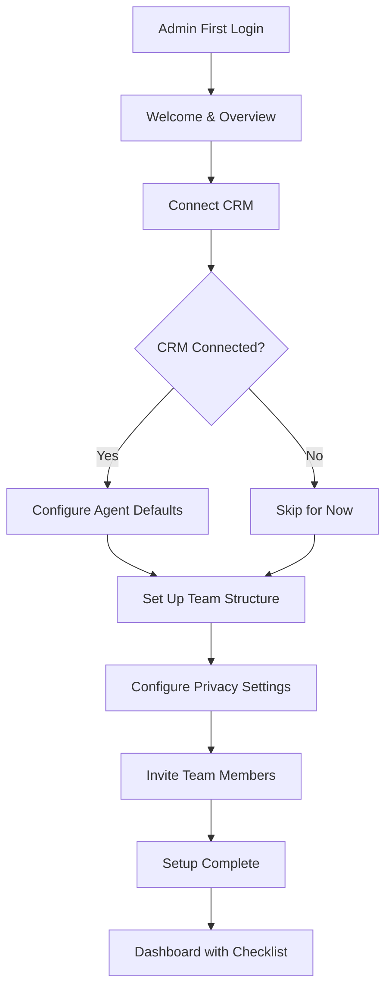

# Admin Onboarding - PRD

## Overview

Admin onboarding defines the first-time experience for workspace administrators setting up AskElephant. The primary entry point is CRM connection, which serves as the foundational integration that unlocks the core value proposition. This initiative establishes "What is Admin Onboarding" through collaboration with CS to diagram the complete workspace setup flow.

## Outcome Chain

```
Admin connects CRM during onboarding
  → so that AskElephant has access to customer data
    → so that agents can automatically update CRM fields
      → so that reps don't do manual data entry
        → so that CRM data stays accurate for forecasting
          → so that revenue outcomes improve
```

## Problem Statement

### What problem?

There is no defined admin onboarding experience. Admins currently navigate setup without structured guidance, leading to incomplete configurations, delayed time-to-value, and increased CS burden.

### Who has it?

- **Workspace Admins** setting up AskElephant for the first time
- **Sales Leaders** who are often the initial admin
- **RevOps** managing integrations and configurations
- **CS Team** who currently hand-hold admins through setup

### Why now?

CRM integration is the most critical first step for realizing AskElephant's value. Without a structured admin onboarding, we lose users before they experience the core product.

> "Admin onboarding will actually relate closely to [CRM] because one of the first things we wanna do is have the experience of CRM." — Planning Session

## Target Personas

- [ ] Sales Representative
- [x] Sales Leader
- [ ] CSM
- [x] RevOps

## Success Metrics

| Metric | Current | Target | Timeline |
|--------|---------|--------|----------|
| Time to first CRM connection | Unknown | < 10 min | Q1 2026 |
| Admin onboarding completion rate | Unknown | > 80% | Q1 2026 |
| CS hand-holding required | High | Minimal | Q2 2026 |
| Integration setup success rate | Unknown | > 90% | Q1 2026 |

## User Stories

### Epic: CRM-First Admin Setup

**As a** workspace admin,
**I want to** connect my CRM as the first step of setup,
**So that** AskElephant can immediately start delivering value from my meetings.

#### Acceptance Criteria
- [ ] CRM selection is prominently featured in admin onboarding
- [ ] Support for HubSpot, Salesforce as primary options
- [ ] Clear progress indication through setup steps
- [ ] Successful connection confirmed with visual feedback

### Epic: Guided Workspace Configuration

**As a** workspace admin,
**I want to** follow a guided setup flow that explains each step,
**So that** I can configure AskElephant correctly without CS assistance.

#### Acceptance Criteria
- [ ] Step-by-step wizard for workspace configuration
- [ ] Contextual help explaining "why" for each setting
- [ ] Ability to skip and return to steps later
- [ ] Progress saved automatically

### Epic: Team Member Onboarding Setup

**As a** workspace admin,
**I want to** configure how new team members will be onboarded,
**So that** my team gets a consistent first experience.

#### Acceptance Criteria
- [ ] Configure user roles and permissions
- [ ] Set default privacy settings for workspace
- [ ] Configure notification preferences
- [ ] Preview user onboarding flow

## Scope

### In Scope
- CRM connection as first step
- Workspace configuration wizard
- Integration setup flow (CRM focus)
- Privacy settings configuration (manager/owner level)
- User role and team setup
- CS flow diagram collaboration

### Out of Scope
- User onboarding (separate initiative)
- Advanced workflow configuration (post-onboarding)
- Custom integration development
- Enterprise SSO setup (separate flow)

### Future Considerations
- Multi-CRM support
- Custom onboarding flows by segment
- Automated health checks post-setup

## Design

### User Flow



### Key Screens

1. **Welcome Screen** - Overview of what they'll configure
2. **CRM Selection** - Choose and connect CRM
3. **CRM Scope Selection** - What data to sync
4. **Agent Configuration** - Default workflows for call types
5. **Team Setup** - Roles, permissions, structure
6. **Privacy Configuration** - Workspace privacy rules
7. **Completion** - Success state with next steps

### Wireframes/Mockups
<!-- Link to Figma or embed screenshots -->

### Prototype
<!-- Link to Storybook prototype when available -->

## Technical Considerations

- OAuth flows for CRM connections
- Workspace state management (incomplete setup tracking)
- Multi-workspace handling
- Permission checks throughout flow
- Analytics for funnel tracking

## Dependencies

- CRM Experience End-to-End (configuration UI)
- Privacy Determination Agent (settings)
- FGA Engine (permissions)
- User Onboarding (handoff point)
- CS Team (flow diagram collaboration)

## Risks & Mitigations

| Risk | Impact | Likelihood | Mitigation |
|------|--------|------------|------------|
| CRM connection failures | High | Medium | Robust error handling, retry flows, CS escalation path |
| Scope creep (too many settings) | Medium | High | Progressive disclosure, defer advanced to post-onboarding |
| CS dependency delays diagram | Medium | Medium | Start with assumptions, iterate with CS input |

## Timeline

### Milestones

| Milestone | Date | Status |
|-----------|------|--------|
| PRD Complete | 2026-01-16 | ✅ |
| CS Flow Diagram | TBD | ⬜ |
| Design Complete | TBD | ⬜ |
| Prototype Review | TBD | ⬜ |
| Development Start | TBD | ⬜ |
| Beta | TBD | ⬜ |
| GA | TBD | ⬜ |

## Open Questions

- [ ] What is the complete current CS-led onboarding flow?
- [ ] Which CRM should be prioritized (HubSpot vs Salesforce)?
- [ ] How does this differ by customer segment (SMB vs mid-market)?
- [ ] What are the minimum "bricks" we can ship incrementally?
- [ ] How do we handle admins who want to skip CRM connection?

---
*Last updated: 2026-01-16*
*Owner: Bryan → Jason*
