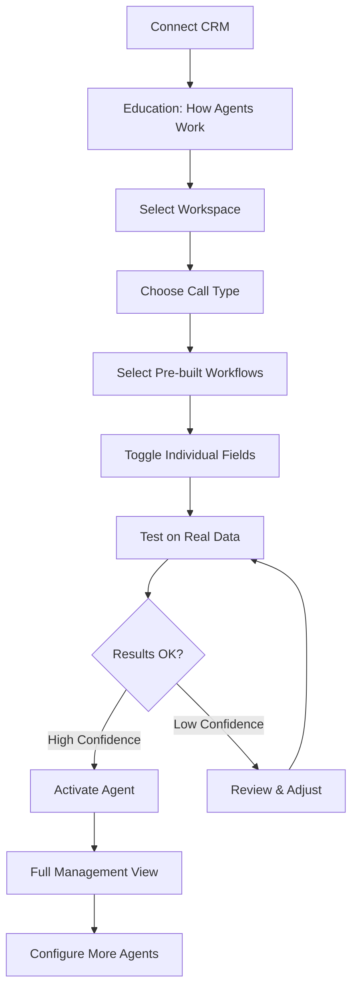
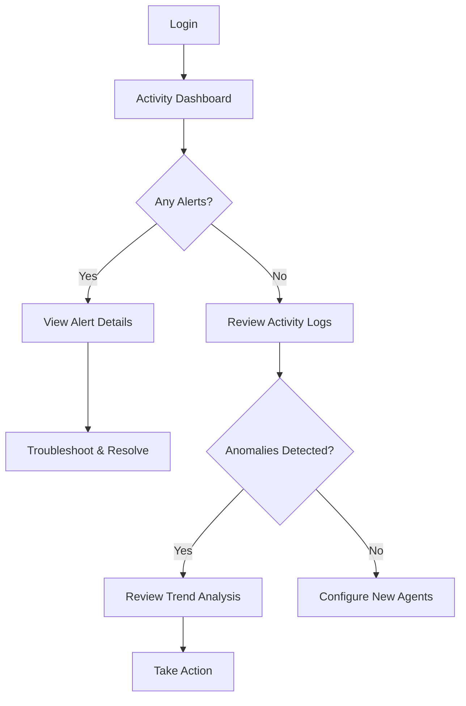
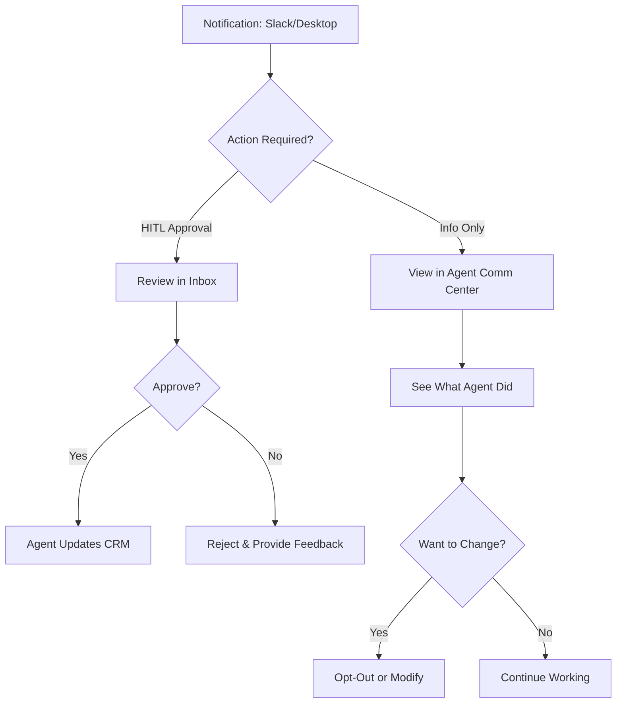
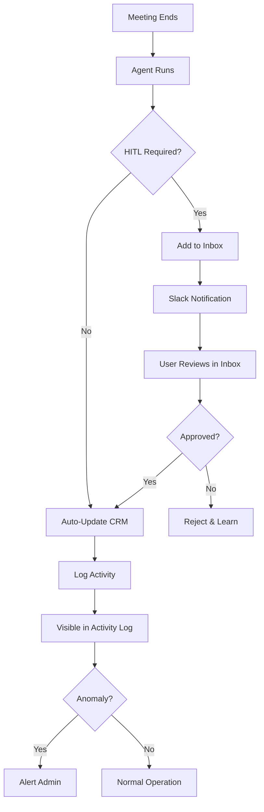

# CRM Experience End-to-End - PRD

## Overview

The CRM Experience End-to-End initiative defines the complete user journey for CRM integration—from initial connection through daily proactive engagement. This builds upon the existing HubSpot Agent Config UI PRD, adding onboarding confidence-building, inbox/approval workflows, notification engine integration, activity visibility, anomaly detection, and user self-service capabilities.

**The core insight:** Users need **confidence** that the system works before they'll trust it with their CRM data. The experience must build that confidence through education, testing, and visibility.

## Outcome Chain

```
Admin configures CRM agent through guided, confidence-building setup
  → so that they test and validate before going live
    → so that agents run automatically after calls
      → so that CRM data is updated without manual entry
        → so that reps trust the automation (via visibility + control)
          → so that CRM data stays accurate for forecasting
            → so that pipeline decisions improve and revenue increases
```

## Problem Statement

### What problem?

Users configure CRM agents but lack visibility and confidence. There's no centralized place to see agent activity, approve changes, understand anomalies, or trust that the system is working correctly. This creates distrust and abandonment.

### Who has it?

- **RevOps Admins/Partners** trying to manage CRM automation across the team
- **Sales Reps** who need to see what agents did to their CRM and communicate with the agent
- **Sales Leaders** who want confidence in automated data quality

### Evidence

> "I want to be able to actually test and see an output so that I have confidence. That's the key there is I need the confidence of, k. I just got this set up, and it is actually going to work how I want it to work."

> "AskElephant is working with me and being proactive to help me understand trends, things that might not be that seem like they're anomalies."

> "For both the user and an admin, I should be to see everywhere that the HubSpot agent is touching, what data it's touching, where it's running."

## Target Personas

- [x] Sales Representative
- [x] Sales Leader
- [ ] CSM
- [x] RevOps Admin/Partner

## Success Metrics

| Metric | Current | Target | Timeline |
|--------|---------|--------|----------|
| CRM agent retention (configure → continue using) | Unknown | +30% | Q1 2026 |
| Time to first successful agent run | Unknown | < 10 min | Q1 2026 |
| Time to configure single property | ~10 hours | < 5 min | Q1 2026 |
| Agent success rate (successful updates) | Unknown | > 95% | Q1 2026 |
| Human approval turnaround time | N/A | < 4 hours | Q2 2026 |
| Admin confidence score (post-setup survey) | N/A | > 8/10 | Q1 2026 |

---

## User Stories

### Epic 1: Confidence-Building Onboarding

**As a** workspace admin/partner,
**I want to** understand how the CRM agent works through education and examples,
**So that** I have confidence before committing to automation.

#### Acceptance Criteria
- [ ] Educational content explains how agents work
- [ ] Specific, pre-built examples available to implement quickly
- [ ] Can test on real data before activating
- [ ] See actual output with confidence scores
- [ ] Start with one or handful of things first (not overwhelming)
- [ ] Clear transition from setup to management view

> "I'm getting educated on how it works. I have specific examples that I can put into place very quickly."

---

### Epic 2: CRM Onboarding Flow

**As a** workspace admin,
**I want to** configure CRM agents through a guided step-by-step flow,
**So that** I can get value quickly without complex prompt engineering.

#### Acceptance Criteria
- [ ] Connect CRM with OAuth
- [ ] Select workspace/scope
- [ ] Choose call types to configure
- [ ] Select from pre-built workflow templates
- [ ] Toggle individual fields on/off
- [ ] Test on real data with confidence scores
- [ ] Review low-confidence items before activation
- [ ] Submit takes to full management view

---

### Epic 3: Admin Activity Dashboard

**As a** workspace admin,
**I want to** see an activity dashboard of all CRM agent actions,
**So that** I can understand what's happening, identify issues, and spot anomalies.

#### Acceptance Criteria
- [ ] View all agent runs with timestamp
- [ ] Filter by agent/workflow type
- [ ] Filter by CRM tool (HubSpot, Salesforce)
- [ ] See confidence scores for each update
- [ ] Drill into specific meeting that triggered update
- [ ] Receive alerts when something is broken
- [ ] See proactive anomaly/trend detection from AskElephant
- [ ] Easy troubleshooting path to resolution

> "I'm able to get alerts of if something is broken. I'm able to come in manually and see just activity logs and what's going on."

---

### Epic 4: User Agent Communication Center

**As a** sales rep,
**I want to** see a place where the agent communicates with me,
**So that** I know what it did and can respond to requests.

#### Acceptance Criteria
- [ ] Centralized view of agent communications
- [ ] Human-in-the-loop requests clearly surfaced
- [ ] Reporting/status updates from agent
- [ ] Easy opt-out path ("if you don't want that, do something else")
- [ ] See everywhere HubSpot agent is touching my data
- [ ] See what data is being modified

> "When I log in to AskElephant, I want a place where I can see the agent communicating to me. This is what I did."

---

### Epic 5: Inbox for Human-in-the-Loop

**As a** user with pending approvals,
**I want to** see all items requiring my review in one place,
**So that** I can quickly approve or reject agent actions.

#### Acceptance Criteria
- [ ] Centralized inbox for all HITL approvals
- [ ] Clear before/after comparison for changes
- [ ] One-click approve/reject
- [ ] Batch approve capability
- [ ] Slack notification when items need review
- [ ] Mobile-friendly review experience
- [ ] Users see only their own items
- [ ] Admins see all items

---

### Epic 6: Notification Engine Integration

**As a** user,
**I want to** receive notifications in Slack and desktop when agents complete or need input,
**So that** I stay informed without checking the app constantly.

#### Acceptance Criteria
- [ ] Slack message after agent runs
- [ ] Desktop notifications (optional)
- [ ] Notification when approval needed
- [ ] Configurable notification preferences
- [ ] Action buttons in Slack for quick approval

> "Not even logging in, just in general. I should be getting Slack notifications if I want or desktop notifications."

---

### Epic 7: Proactive Anomaly Detection

**As a** workspace admin,
**I want to** receive proactive alerts about trends and anomalies,
**So that** I can address issues before they become problems.

#### Acceptance Criteria
- [ ] AskElephant surfaces unusual patterns
- [ ] Alerts for anomalies in agent behavior
- [ ] Trend visibility over time
- [ ] Recommendations for resolution

> "AskElephant is working with me and being proactive to help me understand trends, things that might not be that seem like they're anomalies."

---

### Epic 8: User Self-Service Automations

**As a** sales rep,
**I want to** build my own automations that only impact my data,
**So that** I can customize my workflow without admin involvement.

#### Acceptance Criteria
- [ ] Easy discovery of automation capabilities
- [ ] Build personal automations
- [ ] Scoped to own data only (not team-wide)
- [ ] Clear separation from admin-managed automations

> "For a user, I should still be able to go easily see how to build my own automations if I want it. That would only impact my own."

---

### Epic 9: HubSpot Query Interface

**As a** user,
**I want to** easily query HubSpot and get accurate data,
**So that** I can use that data in my day-to-day work.

#### Acceptance Criteria
- [ ] Natural language query interface
- [ ] Accurate data retrieval
- [ ] Integration with daily workflows
- [ ] Results usable in context

> "It should be easy for me to query HubSpot and actually get accurate data, and be able to use that HubSpot data within my day to day."

---

### Epic 10: Workflow Filtering by Tool

**As a** workspace admin,
**I want to** filter all workflows by the tools they use,
**So that** I can see everything impacting my CRM in one view.

#### Acceptance Criteria
- [ ] Filter by HubSpot / Salesforce / etc.
- [ ] Group related workflows together
- [ ] See usage stats per workflow
- [ ] See success/confidence metrics per workflow

---

## Scope

### In Scope
- Confidence-building onboarding flow
- CRM onboarding wizard (guided setup)
- Admin activity dashboard with anomaly detection
- User agent communication center
- Inbox for human-in-the-loop approvals
- Slack and desktop notifications
- Proactive trend/anomaly alerts
- User self-service automations (scoped to own data)
- HubSpot query interface
- Workflow filtering by tool
- Pre-built workflow templates

### Out of Scope
- Non-CRM agent types
- Custom CRM development
- Full inbox for all notification types (separate initiative)
- Workflow builder enhancements (separate initiative)
- Salesforce-specific features (HubSpot first)

### Future Considerations
- AI-powered workflow suggestions
- Cross-CRM sync (HubSpot ↔ Salesforce)
- Custom CRM object support
- Advanced anomaly ML models

---

## Design

### User Flow: Admin Onboarding (Confidence-Building)



### User Flow: Admin Daily Operations



### User Flow: Rep Daily Use



### User Flow: Meeting to CRM Update



### Key Screens

1. **Onboarding Wizard** - Step-by-step confidence-building setup
2. **Admin Activity Dashboard** - All agent actions, alerts, anomalies
3. **User Agent Communication Center** - Agent messages and status
4. **Inbox** - Pending approvals centralized
5. **Workflow Manager** - Filter and manage by tool
6. **Notification Settings** - Configure alert preferences
7. **Personal Automations** - User self-service builder
8. **HubSpot Query** - Natural language data access

### Prototype
- See [hubspot-agent-config-ui](../hubspot-agent-config-ui/prd.md) for configuration UI
- Onboarding wizard: See `prototypes/src/components/HubSpotConfig/v3/`
- Activity dashboard: TBD
- Agent communication center: TBD
- Inbox prototype: TBD

---

## Technical Considerations

- Real-time activity log updates (WebSocket or polling)
- Slack bot integration for notifications
- Desktop notification API integration
- Inbox state management across devices
- Confidence score calculation and display
- Anomaly detection algorithm
- CRM API rate limiting
- User-scoped vs admin-scoped data access
- Natural language query processing for HubSpot

---

## Dependencies

- [HubSpot Agent Config UI](../hubspot-agent-config-ui/prd.md) - Configuration foundation
- Notification Engine - Alert system
- Admin Onboarding - Entry point
- Slack Integration - HITL notifications
- Desktop Notification System - Browser/Electron notifications

---

## Risks & Mitigations

| Risk | Impact | Likelihood | Mitigation |
|------|--------|------------|------------|
| Users don't trust automation | High | High | Confidence-building onboarding, test before activate |
| Inbox becomes overwhelming | High | Medium | Smart batching, priority sorting, auto-approve for high confidence |
| Notification fatigue | Medium | High | Configurable preferences, digest options |
| CRM API rate limits | High | Medium | Batching, caching, retry logic |
| Low confidence scores create distrust | High | Medium | Clear explanations, easy adjustment path |
| Anomaly detection false positives | Medium | Medium | Tunable thresholds, user feedback loop |
| User automations conflict with admin | Medium | Low | Clear scoping, visibility to admins |

---

## Timeline

### Milestones

| Milestone | Date | Status |
|-----------|------|--------|
| PRD Complete | 2026-01-16 | ✅ |
| Research Updated | 2026-01-16 | ✅ |
| Design Brief Complete | TBD | ⬜ |
| Onboarding Wizard Prototype | TBD | ⬜ |
| Activity Dashboard Prototype | TBD | ⬜ |
| Agent Comm Center Prototype | TBD | ⬜ |
| Inbox Prototype | TBD | ⬜ |
| Slack HITL MVP | In Progress | 🔄 |
| Full Beta | TBD | ⬜ |
| GA | TBD | ⬜ |

---

## Open Questions

- [ ] How do we handle companies vs contacts syncing?
- [ ] Should deals be a first-class object?
- [ ] What's the right balance of admin control vs opinionated defaults?
- [ ] How do we prevent inbox from becoming a bottleneck?
- [ ] What confidence threshold triggers HITL vs auto-approve?
- [ ] How do we surface anomalies without creating alert fatigue?
- [ ] What's the scope of "personal automations" for users?
- [ ] How do we integrate HubSpot querying into daily workflows?

---

*Last updated: 2026-01-16*
*Owner: Tyler/Bryan*

## Related Documents
- [HubSpot Agent Config UI PRD](../hubspot-agent-config-ui/prd.md)
- [Notification Engine](../current/notification-engine/analysis.md)
- [Design Brief](./design-brief.md)
- [Engineering Spec](./engineering-spec.md)
- [GTM Brief](./gtm-brief.md)
