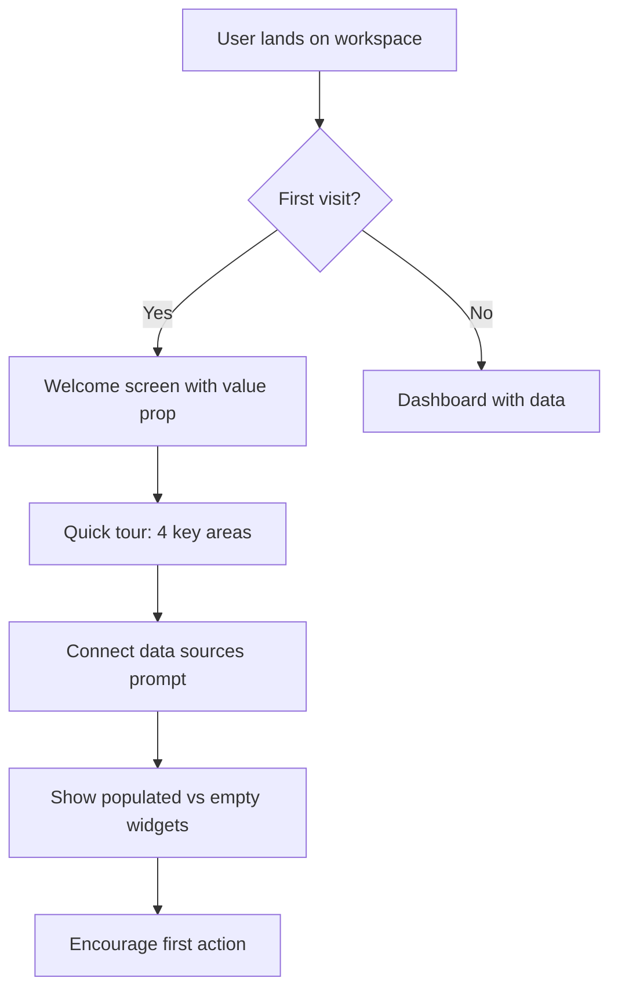
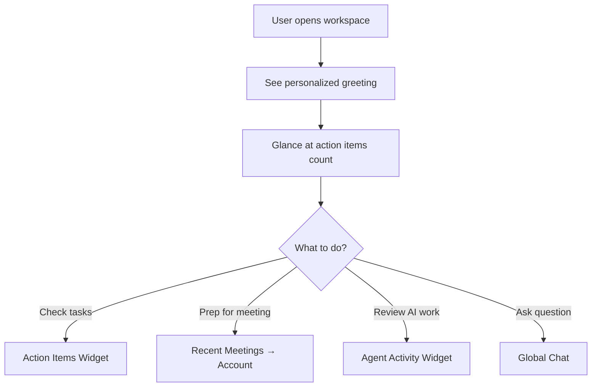
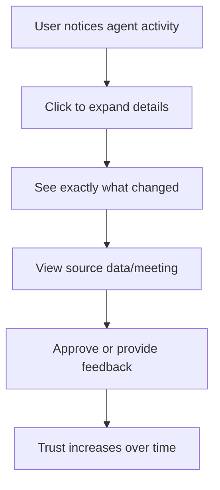

# Design Brief: Rep Workspace

## Overview

Rep Workspace is a personalized dashboard for sales representatives that consolidates key information from across AskElephant into a single, actionable view. The design prioritizes **transparency**, **trust-building**, and **progressive disclosure** based on jury feedback from skeptical users.

## Design Principles (Post-Jury Iteration)

### 1. Trust Through Transparency
Every piece of data shows its source. Users should never wonder "where did this come from?"

### 2. Progressive Disclosure
Start simple, reveal complexity as users engage. First-time users see an onboarding experience, not an overwhelming dashboard.

### 3. Prove Value, Don't Promise It
Show concrete time savings and actions completed, not marketing claims.

### 4. No Surprises
Users control what happens. Actions are visible before they execute.

---

## User Flows

### Flow 1: First-Time User Experience



**Key screens:**
1. **Welcome overlay** - "Your personal command center"
2. **Guided tour** - Highlight each widget area
3. **Setup prompts** - Connect calendar, CRM if not done
4. **Success moment** - First action item completed

### Flow 2: Returning User (Daily Use)



### Flow 3: Trust Verification (Skeptic Path)



---

## Key Screens & States

### 1. Dashboard States

| State | Description | Visual Treatment |
|-------|-------------|------------------|
| **First Visit** | Welcome overlay + guided setup | Dimmed background, modal focus |
| **Empty** | No data yet (new user) | Illustration + setup prompts |
| **Partial** | Some widgets populated | Progressive loading, setup CTAs |
| **Full** | All widgets with data | Standard dashboard layout |
| **Loading** | Data being fetched | Skeleton loaders per widget |
| **Error** | Widget failed to load | Error message + retry option |

### 2. Widget States (Each Widget)

| State | Treatment |
|-------|-----------|
| **Loading** | Skeleton with shimmer animation |
| **Empty** | Helpful message + action to populate |
| **Populated** | Data with freshness indicator |
| **Error** | Inline error with retry |
| **Refreshing** | Subtle loading indicator |

---

## Data Provenance Design

### Widget Data Sources (Transparency Feature)

Each widget shows its data source on hover/tap:

| Widget | Data Source | Freshness |
|--------|-------------|-----------|
| Action Items | AI extraction from meetings | Real-time |
| Recent Meetings | Calendar + Recording sync | < 1 min |
| My Accounts | CRM integration | Last sync: X min ago |
| Agent Activity | Automation logs | Real-time |

### Visual Treatment

```
┌─────────────────────────────────────────┐
│ Action Items (3)          ℹ️ · 🔄 Live  │
│ ────────────────────────────────────────│
│  □ Follow up with Acme                  │
│  □ Send proposal                        │
│                                         │
│ ─────────────────────────────────────── │
│ 📊 Source: AI extracted from meetings   │
│ 🔄 Updated: Just now                    │
└─────────────────────────────────────────┘
```

---

## Trust Indicators

### Global Status Bar

```
┌─────────────────────────────────────────────────────────────┐
│ 🟢 All systems connected • Last sync: 2 min ago • View logs │
└─────────────────────────────────────────────────────────────┘
```

### Widget-Level Indicators

- **🟢 Live** - Real-time data
- **🔵 Synced 5m ago** - Recently updated
- **🟡 Syncing...** - Update in progress
- **🔴 Error** - Failed to fetch

### Agent Activity Trust Features

- Show **before/after** for each change
- Link to **source meeting** that triggered action
- **Approval queue** for pending changes
- **Undo** option for completed actions (where possible)

---

## First-Time Experience (Onboarding)

### Screen 1: Welcome

```
┌─────────────────────────────────────────┐
│                                         │
│     👋 Welcome to Your Workspace        │
│                                         │
│  Your personal command center for       │
│  managing deals and staying on top      │
│  of customer conversations.             │
│                                         │
│  What you'll see:                       │
│  • Action items from your meetings      │
│  • Recent meeting insights              │
│  • Account health at a glance           │
│  • AI agent activity on your behalf     │
│                                         │
│        [ Take a Quick Tour ]            │
│            Skip for now                 │
│                                         │
└─────────────────────────────────────────┘
```

### Screen 2-5: Feature Tour (Spotlight)

Each widget gets a spotlight moment:
1. Action Items - "Tasks extracted from your meetings"
2. Recent Meetings - "Quick access to key insights"
3. My Accounts - "Health scores from your CRM"
4. Agent Activity - "See exactly what AI did for you"

### Screen 6: Setup Complete

```
┌─────────────────────────────────────────┐
│                                         │
│     ✅ You're All Set!                  │
│                                         │
│  Your workspace will populate as you    │
│  have meetings and connect your tools.  │
│                                         │
│  Connected:                             │
│  ✅ Calendar (12 upcoming meetings)     │
│  ✅ Salesforce (47 accounts)            │
│                                         │
│  💡 Tip: Ask Elephant anything about    │
│  your deals using the chat below.       │
│                                         │
│        [ Go to My Workspace ]           │
│                                         │
└─────────────────────────────────────────┘
```

---

## Empty States

### Action Items - Empty

```
┌─────────────────────────────────────────┐
│ Action Items                            │
│ ─────────────────────────────────────── │
│                                         │
│         📋                              │
│    No action items yet                  │
│                                         │
│  Action items are automatically         │
│  extracted from your recorded meetings. │
│                                         │
│  [ Record a Meeting ]                   │
│                                         │
└─────────────────────────────────────────┘
```

### Agent Activity - Empty

```
┌─────────────────────────────────────────┐
│ Agent Activity                          │
│ ─────────────────────────────────────── │
│                                         │
│         🤖                              │
│    No agent activity yet                │
│                                         │
│  When AI agents update your CRM or      │
│  take actions, you'll see them here.    │
│                                         │
│  Everything is logged. Nothing hidden.  │
│                                         │
│  [ Learn about AI Agents ]              │
│                                         │
└─────────────────────────────────────────┘
```

---

## Interaction Patterns

### Widget Hover/Focus

```
Hover state:
┌─────────────────────────────────────────┐
│ Action Items (3)          ℹ️ · 🔄 Live │◄── Info icon appears
│ ─────────────────────────────────────── │
│  → Subtle highlight on row              │
│  → "View all" becomes visible           │
└─────────────────────────────────────────┘
```

### Click-Through Navigation

| Click Target | Destination |
|--------------|-------------|
| Action item | Action item detail / Meeting context |
| Meeting | Meeting detail page |
| Account | Customer journey page |
| Agent activity | Activity log with full context |

### Keyboard Shortcuts

| Shortcut | Action |
|----------|--------|
| `⌘K` | Open global chat |
| `⌘1-4` | Focus widget 1-4 |
| `⌘R` | Refresh all data |
| `?` | Show keyboard shortcuts |

---

## Accessibility

### Requirements

- [ ] All widgets keyboard navigable
- [ ] Screen reader labels for icons/badges
- [ ] Color-blind safe status indicators (not color-only)
- [ ] Focus indicators visible
- [ ] Skip links for widget navigation
- [ ] Reduced motion option for animations

### Color Contrast

All text meets WCAG AA (4.5:1 minimum):
- Primary text: `#1e293b` on white
- Secondary text: `#64748b` on white
- Status badges use icons + color

---

## Responsive Breakpoints

| Breakpoint | Layout |
|------------|--------|
| Desktop (≥1024px) | 2x2 grid, sidebar visible |
| Tablet (768-1023px) | 2x2 grid, sidebar collapsed |
| Mobile (<768px) | Single column, stacked widgets |

### Mobile Adaptations

- Widgets become full-width cards
- Bottom navigation for quick actions
- Swipe between widgets
- Chat accessible via FAB

---

## Animation & Motion

### Loading States

- Skeleton shimmer: 1.5s duration, ease-in-out
- Widget fade-in: 200ms, staggered by 50ms

### Interactions

- Hover transitions: 150ms
- Modal open/close: 200ms with backdrop fade
- Toast notifications: slide-in from top-right

### Reduced Motion

When `prefers-reduced-motion`:
- Disable shimmer animation
- Instant transitions (no easing)
- No parallax or complex animations

---

## Edge Cases

### Error Handling

| Scenario | Treatment |
|----------|-----------|
| Widget fails to load | Inline error with retry button |
| All widgets fail | Full-page error with support link |
| Partial data | Show available data, indicate missing |
| Stale data (>30 min) | Warning badge, manual refresh option |

### Permission States

| Scenario | Treatment |
|----------|-----------|
| CRM not connected | Setup prompt in My Accounts widget |
| Calendar not connected | Setup prompt, show manual upload option |
| No recording permissions | Explain value, link to settings |

---

## Design Tokens

### Colors

```css
--workspace-bg: #f8fafc;
--card-bg: #ffffff;
--primary: #4f46e5;
--primary-gradient: linear-gradient(135deg, #4f46e5, #7c3aed);
--success: #10b981;
--warning: #f59e0b;
--error: #ef4444;
--text-primary: #1e293b;
--text-secondary: #64748b;
--border: #e2e8f0;
```

### Spacing

```css
--space-widget-gap: 20px;
--space-widget-padding: 16px;
--space-header-height: 64px;
--space-sidebar-width: 224px;
--space-sidebar-collapsed: 64px;
```

### Typography

```css
--font-greeting: 600 24px/1.3 system-ui;
--font-widget-title: 600 14px/1.4 system-ui;
--font-body: 400 14px/1.5 system-ui;
--font-caption: 400 12px/1.4 system-ui;
```

---

## Success Metrics (Design)

| Metric | Target | Measurement |
|--------|--------|-------------|
| First-action time | < 30s | Time to first widget interaction |
| Onboarding completion | > 80% | Users completing tour |
| Return rate D7 | > 60% | Users returning within 7 days |
| Widget engagement | > 3/day | Avg widget clicks per session |
| Trust indicator visibility | > 50% | Users who notice/click info icons |

---

## Design Review Checklist

- [ ] First-time experience feels welcoming, not overwhelming
- [ ] Data sources are clear for each widget
- [ ] Empty states guide user to populate data
- [ ] Error states are recoverable
- [ ] Mobile experience is usable
- [ ] Accessibility requirements met
- [ ] Performance (skeleton loaders) feel fast

---

*Created: 2026-01-16*
*Based on: Jury feedback (45% pass rate iteration)*
*Next: Implement onboarding + trust indicators in prototype*
