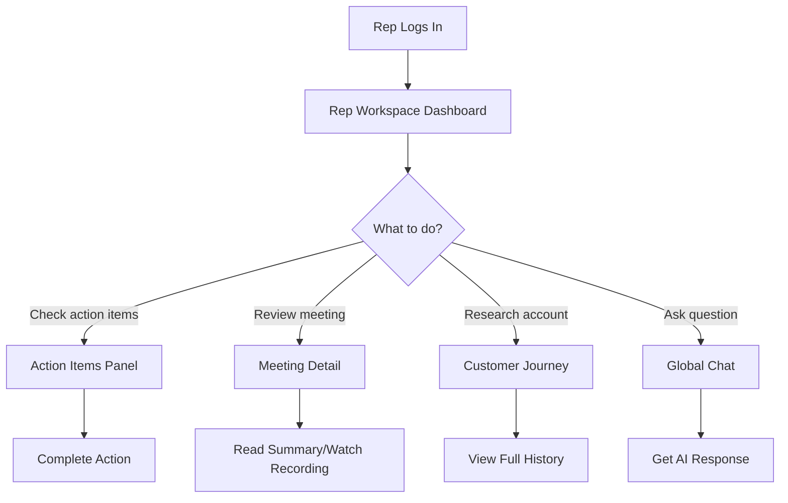

# Rep Workspace - PRD

## Overview

Rep Workspace is a dedicated dashboard experience for sales representatives. It serves as the primary interface for reps to understand their customer interactions, see AI-generated insights, and take action on follow-ups. The workspace connects to global chat and customer journey data to provide a comprehensive view of each rep's pipeline.

## Outcome Chain

```
Rep has a dedicated workspace with relevant information
  → so that they can quickly see what matters
    → so that they take timely action on deals
      → so that deal velocity increases
        → so that win rates improve
          → so that quota attainment increases
```

## Problem Statement

### What problem?

Sales reps don't have a dedicated experience in AskElephant. They must navigate between multiple views to understand their customers, see agent activity, and find action items. This friction reduces engagement and delays action on critical deals.

### Who has it?

- **Sales Representatives** - Primary users who need quick access to insights
- **Solo Sales Reps** - Need self-coaching, not team monitoring (validated by Maple)
- **Sales Leaders** - Secondary users who want to see rep activity

### Why now?

With global chat launching and CRM agents becoming more capable, reps need a central place to interact with AskElephant's AI capabilities and see the value being delivered.

---

## Customer Validation

### Maple Billing (2026-01-21) - STRONG VALIDATION

Jared Henriques (solo sales rep at Maple) provided **unprompted validation** of the Rep Workspace concept. His requests match the PRD almost exactly.

#### Key Quote - Deal Workspace
> "One of the things that I'd be really keen on is one, just like a pipeline view of mirroring my HubSpot pipeline into, you know, AskElephant for me to very quickly start to say, hey. Cool. Let me hop in on, like, a per account basis or a per deal basis, and then start to see my transcription and actually talk with the the deal property in and of itself."

#### Key Quote - Self-Coaching
> "I am a sales team of one... I'm actually way more interested in coaching from the aspect of, like, cool. Pull out some the common questions that have been asked across all my transcripts."

#### Feature Request Validation

| PRD Feature | Customer Request | Match |
|-------------|-----------------|-------|
| My Accounts section | "Pipeline view mirroring HubSpot" | ✅ Exact |
| Global Chat integration | "Talk with the deal property" | ✅ Exact |
| Agent Activity visibility | "What agents have done on my behalf" | ✅ Exact |
| Customer Journey View | "See my transcription... per account" | ✅ Exact |

#### New Insight: Solo Rep Self-Coaching
Jared's feedback reveals an underserved persona: **solo sales reps** who need self-reflection tools rather than manager oversight. Consider adding self-coaching features to the Coaching Insights future consideration.

**Signal:** `sig-2026-01-21-maple-billing-feedback`

---

## Target Personas

- [x] Sales Representative
- [ ] Sales Leader
- [ ] CSM
- [ ] RevOps

## Success Metrics

| Metric | Current | Target | Timeline |
|--------|---------|--------|----------|
| Rep daily active usage | Unknown | > 70% | Q1 2026 |
| Time to find key information | Unknown | < 30 sec | Q1 2026 |
| Actions taken from workspace | N/A | Tracked | Q1 2026 |
| Rep satisfaction (NPS) | Unknown | > 50 | Q2 2026 |

## User Stories

### Epic: Rep Dashboard

**As a** sales rep,
**I want to** see a dashboard of my recent activity and action items,
**So that** I can quickly understand what needs my attention.

#### Acceptance Criteria
- [ ] See recent meetings with key insights
- [ ] View pending action items
- [ ] Access customer journey information
- [ ] Quick access to global chat

### Epic: Customer Journey View

**As a** sales rep,
**I want to** see the full journey for each of my accounts,
**So that** I can understand the context before my next meeting.

#### Acceptance Criteria
- [ ] View all interactions with a customer
- [ ] See AI-generated insights per account
- [ ] Track deal progress and next steps
- [ ] Access meeting recordings and summaries

### Epic: Agent Activity Visibility

**As a** sales rep,
**I want to** see what agents have done on my behalf,
**So that** I can trust the automation and verify CRM updates.

#### Acceptance Criteria
- [ ] View my agent activity log
- [ ] See CRM updates made
- [ ] Approve/reject pending changes
- [ ] Provide feedback on agent accuracy

### Epic: Global Chat Integration

**As a** sales rep,
**I want to** access global chat from my workspace,
**So that** I can ask questions about my deals and customers.

#### Acceptance Criteria
- [ ] Chat accessible from workspace
- [ ] Context-aware responses based on current view
- [ ] Quick actions from chat responses
- [ ] Search across all my meetings

## Scope

### In Scope
- Rep-specific dashboard
- Recent meetings view
- Action items / to-do list
- Customer journey preview
- Agent activity (own activity only)
- Global chat integration point

### Out of Scope
- Manager/leader view (separate initiative)
- Team-wide analytics
- Full CRM functionality
- Workflow creation/editing

### Future Considerations
- Coaching insights for reps
  - **[NEW]** Solo rep self-coaching (see `hyp-solo-rep-self-coaching`)
  - Cross-call pattern analysis
  - Personal performance trends
- Deal health indicators
- Competitive intelligence integration
- Company/account context in chat list (Maple request)

## Design

### Dashboard Layout

```
┌─────────────────────────────────────────────────────────────────┐
│  Rep Workspace                                    [Global Chat] │
├─────────────────────────────────────────────────────────────────┤
│                                                                 │
│  ┌─────────────────────────┐  ┌─────────────────────────────┐  │
│  │   Action Items (3)       │  │   Recent Meetings           │  │
│  │   ─────────────────────  │  │   ─────────────────────────  │  │
│  │   □ Follow up with Acme  │  │   📞 Acme Corp - Discovery  │  │
│  │   □ Send proposal        │  │   📞 Widget Inc - Demo      │  │
│  │   □ Update deal stage    │  │   📞 Tech Co - Negotiation  │  │
│  └─────────────────────────┘  └─────────────────────────────┘  │
│                                                                 │
│  ┌─────────────────────────────────────────────────────────┐   │
│  │   My Accounts                                            │   │
│  │   ─────────────────────────────────────────────────────  │   │
│  │   Acme Corp       | 12 meetings | Deal: $50k | Stage: 3  │   │
│  │   Widget Inc      | 8 meetings  | Deal: $25k | Stage: 2  │   │
│  │   Tech Co         | 5 meetings  | Deal: $75k | Stage: 4  │   │
│  └─────────────────────────────────────────────────────────┘   │
│                                                                 │
│  ┌─────────────────────────────────────────────────────────┐   │
│  │   Agent Activity                                         │   │
│  │   ─────────────────────────────────────────────────────  │   │
│  │   ✓ Updated Acme deal stage → Negotiation                │   │
│  │   ✓ Added next step: "Send contract"                     │   │
│  │   ⏳ Pending: Update Tech Co probability                  │   │
│  └─────────────────────────────────────────────────────────┘   │
│                                                                 │
└─────────────────────────────────────────────────────────────────┘
```

### User Flow



### Wireframes/Mockups
<!-- Link to Figma or embed screenshots -->

### Prototype
<!-- To be created in prototypes/src/RepWorkspace/ -->

## Technical Considerations

- Real-time updates for agent activity
- Efficient data fetching for dashboard
- Global chat integration point
- Mobile responsiveness
- Personalization by rep

## Dependencies

- Global Chat (integration point)
- CRM Exp EtoE (agent activity)
- Customer Journey Map (account view)
- Inbox (approval integration)

## Risks & Mitigations

| Risk | Impact | Likelihood | Mitigation |
|------|--------|------------|------------|
| Information overload | High | Medium | Progressive disclosure, smart defaults |
| Slow load times | Medium | Medium | Lazy loading, caching |
| Low adoption | High | Medium | User testing with Eileen, iterate quickly |
| Unclear value prop | Medium | Low | Clear onboarding, contextual help |

## Timeline

### Milestones

| Milestone | Date | Status |
|-----------|------|--------|
| PRD Complete | 2026-01-16 | ✅ |
| Prototype v1 | 2026-01-16 | ⬜ |
| Internal Feedback (Eileen) | 2026-01-16 | ⬜ |
| Design Iteration | TBD | ⬜ |
| Customer Testing | TBD | ⬜ |
| Development Start | TBD | ⬜ |
| Beta | TBD | ⬜ |
| GA | TBD | ⬜ |

## Open Questions

- [x] What information do reps need most prominently? → **Validated:** Pipeline/deal view with transcripts (Maple)
- [ ] How does global chat integrate with the workspace?
- [x] What's the relationship to customer journey mapping? → **Validated:** Central to value prop (Maple)
- [ ] Should reps see team activity or only their own?
- [ ] What actions should be possible directly from the workspace?
- [ ] **[NEW]** How do we support solo rep self-coaching vs team coaching?
- [ ] **[NEW]** Should we add company/account context to chat list view? (Maple request)

---
*Last updated: 2026-01-21*
*Owner: Skylar/Tyler*
