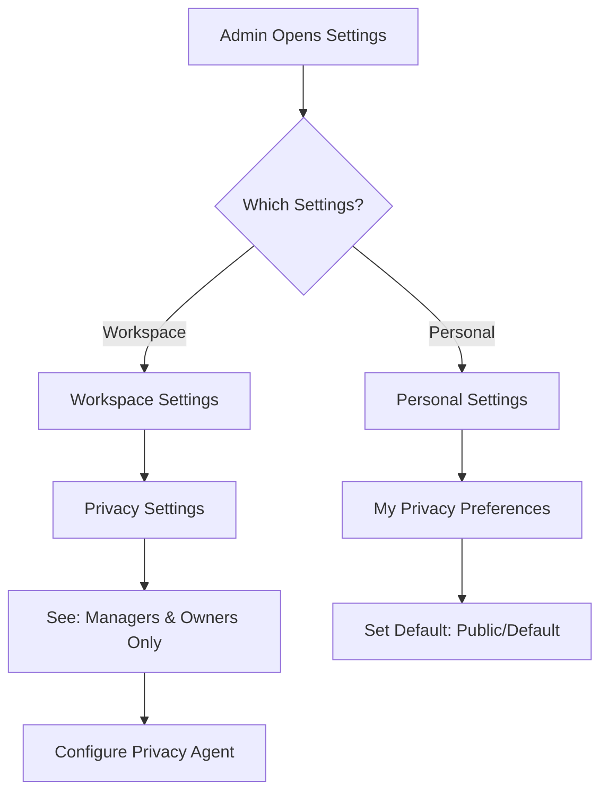

# Settings Redesign - PRD

## Overview

Settings Redesign addresses the confusion around workspace vs. personal settings, with specific focus on privacy agent configuration. The key decision: **workspace privacy settings run on managers/owners only, not users.** Users can mark their own meetings as public but not private. This creates clear separation between admin-controlled and individual settings.

## Outcome Chain

```
Settings clearly communicate scope and impact
  → so that admins understand what they're configuring
    → so that settings are configured correctly
      → so that privacy is handled appropriately
        → so that users trust AskElephant with their data
          → so that adoption and retention improve
```

## Problem Statement

### What problem?

The current settings experience creates confusion about what applies to whom. Workspace settings appear to affect all users, but privacy implications differ by role. This led to extended discussion about whether privacy agent should run on user calls.

### Who has it?

- **Workspace Admins** confused about scope of settings
- **Users** unclear about what they can control
- **CS Team** explaining settings repeatedly

### Evidence

> "The thing that's important is that on the workspace settings, it doesn't say workspace. Like, you have to make it feel like this is a manager owner setting, not a workspace setting."

> "Users, because they can't change it to private or public, if it marks as private, they can't change it back."

## Key Decision: Privacy Agent Scope

**CONFIRMED (Verbal Yes from Woody, Bryan, Skylar, Tyler)**

| Setting Type | Applies To | User Can Control |
|--------------|------------|------------------|
| Workspace Privacy Settings | Managers & Owners ONLY | No |
| Personal Privacy Settings | Individual (self) | Yes |
| User Calls | NOT affected by workspace privacy | Can mark PUBLIC only |

> "The privacy agent on the workspace settings is only going to run managers and owners for now, but we're going to change the title and how explicit it says that this is for managers and owners only."

## Target Personas

- [x] Sales Representative
- [x] Sales Leader
- [x] CSM
- [x] RevOps

## Success Metrics

| Metric | Current | Target | Timeline |
|--------|---------|--------|----------|
| Settings-related support tickets | Unknown | -50% | Q1 2026 |
| Privacy agent adoption (managers) | Unknown | > 70% | Q1 2026 |
| Settings configuration success rate | Unknown | > 95% | Q1 2026 |

## User Stories

### Epic: Clear Workspace Settings Scope

**As a** workspace admin,
**I want to** clearly see that workspace privacy settings apply to managers/owners only,
**So that** I understand the scope of what I'm configuring.

#### Acceptance Criteria
- [ ] Settings page clearly states "Manager & Owner Settings"
- [ ] Explicit text: "This rule set will run on any manager or owner calls in the workspace"
- [ ] Link to personal settings for individual configuration
- [ ] No ambiguity about user call handling

### Epic: Personal Privacy Settings

**As a** user,
**I want to** configure my own privacy preferences,
**So that** I have control over my personal meeting handling.

#### Acceptance Criteria
- [ ] Accessible personal settings section
- [ ] Can mark meetings as PUBLIC (not private)
- [ ] Clear explanation of what users can/cannot control
- [ ] Consistent with workspace settings where applicable

### Epic: Feedback Collection

**As a** workspace admin,
**I want to** request user-level privacy control if I need it,
**So that** product team knows demand for this feature.

#### Acceptance Criteria
- [ ] Feedback prompt in settings
- [ ] Easy submission for feature request
- [ ] Clear explanation of current limitation

## Scope

### In Scope
- Workspace settings relabeling (Manager & Owner Settings)
- Privacy agent scope clarification
- Personal settings section
- Feedback collection mechanism
- Settings page prototype

### Out of Scope
- User-level privacy agent (future consideration)
- Full settings architecture redesign
- AI-first settings (per product vision—separate initiative)
- Integration-specific settings

### Future Considerations
- Enable workspace admins to control user privacy settings
- AI-first settings configuration (chat-based)
- FGA-based settings permissions

## Design

### Settings Structure

```
Settings
├── Workspace Settings (visible to admins)
│   ├── Privacy (Managers & Owners)
│   │   └── "These rules apply to manager and owner calls only"
│   ├── Integrations
│   ├── Team Management
│   └── [Other workspace settings]
│
└── Personal Settings (visible to all)
    ├── My Privacy Preferences
    │   └── "Mark my meetings as: [Public] [Default]"
    ├── Notifications
    └── [Other personal settings]
```

### Privacy Settings UI

```
┌─────────────────────────────────────────────────────────────────┐
│  Privacy Settings (Managers & Owners)                           │
├─────────────────────────────────────────────────────────────────┤
│                                                                 │
│  ℹ️ These privacy rules apply to manager and owner calls only.  │
│     Users can configure their own settings in Personal Settings.│
│                                                                 │
│  ┌─────────────────────────────────────────────────────────┐   │
│  │  Privacy Agent                                    [ON]  │   │
│  │  ───────────────────────────────────────────────────────│   │
│  │  Automatically determine meeting privacy based on       │   │
│  │  conversation content and participants.                 │   │
│  │                                                         │   │
│  │  [Configure Rules...]                                   │   │
│  └─────────────────────────────────────────────────────────┘   │
│                                                                 │
│  ─────────────────────────────────────────────────────────────  │
│                                                                 │
│  💡 Want privacy controls for user calls too?                   │
│     [Request Feature]                                           │
│                                                                 │
└─────────────────────────────────────────────────────────────────┘
```

### Personal Settings UI

```
┌─────────────────────────────────────────────────────────────────┐
│  My Privacy Preferences                                         │
├─────────────────────────────────────────────────────────────────┤
│                                                                 │
│  ℹ️ These settings apply to your meetings only.                 │
│                                                                 │
│  Default Meeting Visibility                                     │
│  ┌─────────────────────────────────────────────────────────┐   │
│  │  ○ Default (follow workspace rules)                     │   │
│  │  ○ Public (share with team by default)                  │   │
│  └─────────────────────────────────────────────────────────┘   │
│                                                                 │
│  Note: You can mark individual meetings as public after         │
│  they're recorded. Private meetings are determined by           │
│  workspace privacy rules.                                       │
│                                                                 │
└─────────────────────────────────────────────────────────────────┘
```

### User Flow



### Wireframes/Mockups
<!-- Link to Figma or embed screenshots -->

### Prototype
<!-- To be created in prototypes/src/SettingsRedesign/ -->

## Technical Considerations

- Privacy agent scoping by user role
- Settings state management
- Role-based settings visibility
- Feedback collection integration

## Dependencies

- Privacy Determination Agent v2 (implementation)
- FGA Engine (future permissions)
- User Onboarding (settings introduction)

## Risks & Mitigations

| Risk | Impact | Likelihood | Mitigation |
|------|--------|------------|------------|
| User confusion about limitations | Medium | Medium | Clear explanations, contextual help |
| Demand for user-level control | Medium | High | Feedback mechanism, roadmap communication |
| Breaking existing configurations | High | Low | Careful migration, communication |

## Timeline

### Milestones

| Milestone | Date | Status |
|-----------|------|--------|
| PRD Complete | 2026-01-16 | ✅ |
| Prototype v1 | 2026-01-16 | ⬜ |
| Privacy Agent Scope Implemented | 2026-01-16 | 🔄 |
| Settings UI Updated | TBD | ⬜ |
| Open Beta | 2026-01-16 (Target) | ⬜ |
| GA | TBD | ⬜ |

## Open Questions

- [ ] How do we communicate this change to existing users?
- [ ] Should personal privacy settings be part of user onboarding?
- [ ] What's the path to enabling user-level privacy control?
- [ ] How do we handle edge cases (e.g., meeting with manager + user)?

---
*Last updated: 2026-01-16*
*Owner: Skylar/Tyler*

## Appendix: Decision Record

### Privacy Agent Scope Decision
**Date:** 2026-01-16
**Deciders:** Woody, Bryan, Skylar, Tyler
**Decision:** Workspace privacy settings apply to managers/owners only. Users can mark public but not private.

**Rationale:**
> "Users, because they can't change it to private or public, if it marks as private, they can't change it back. So until we give people the ability to let decide if they want their users to have private meetings or not, then it doesn't make sense for us to turn it on for people."

**Verbal Confirmations:**
- Woody: "Yes"
- Bryan: "Verbal yes for me"
- Skylar: "Yeah"
- Tyler: Confirmed as scribe
