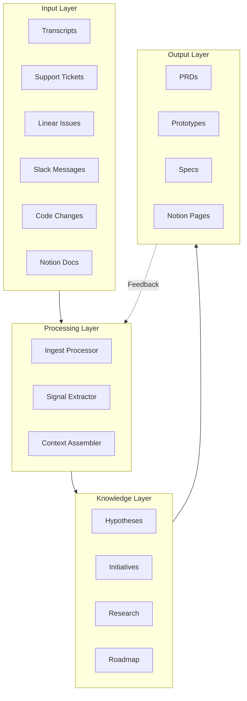
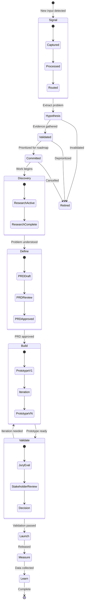
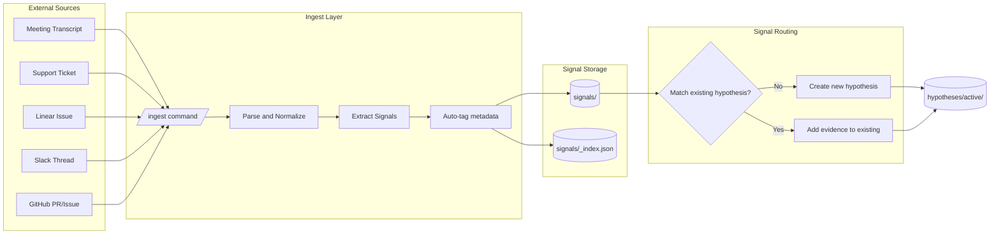
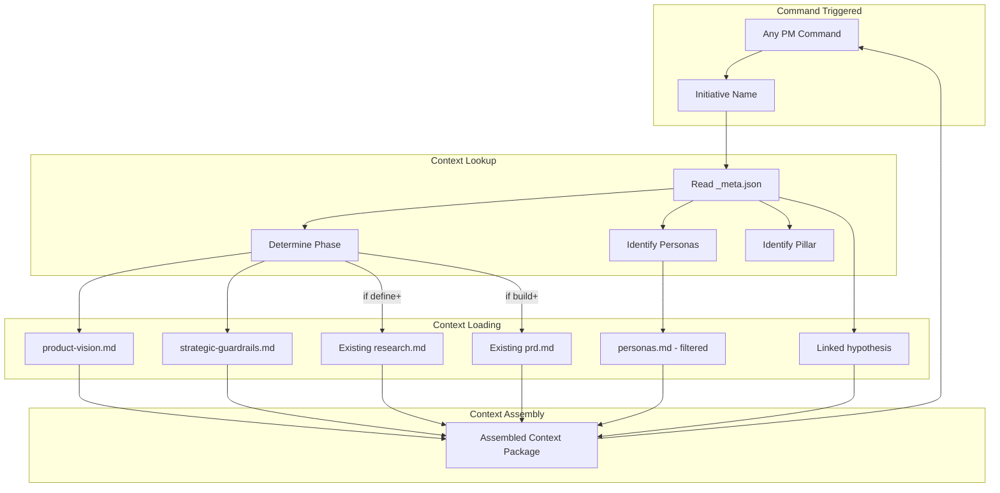
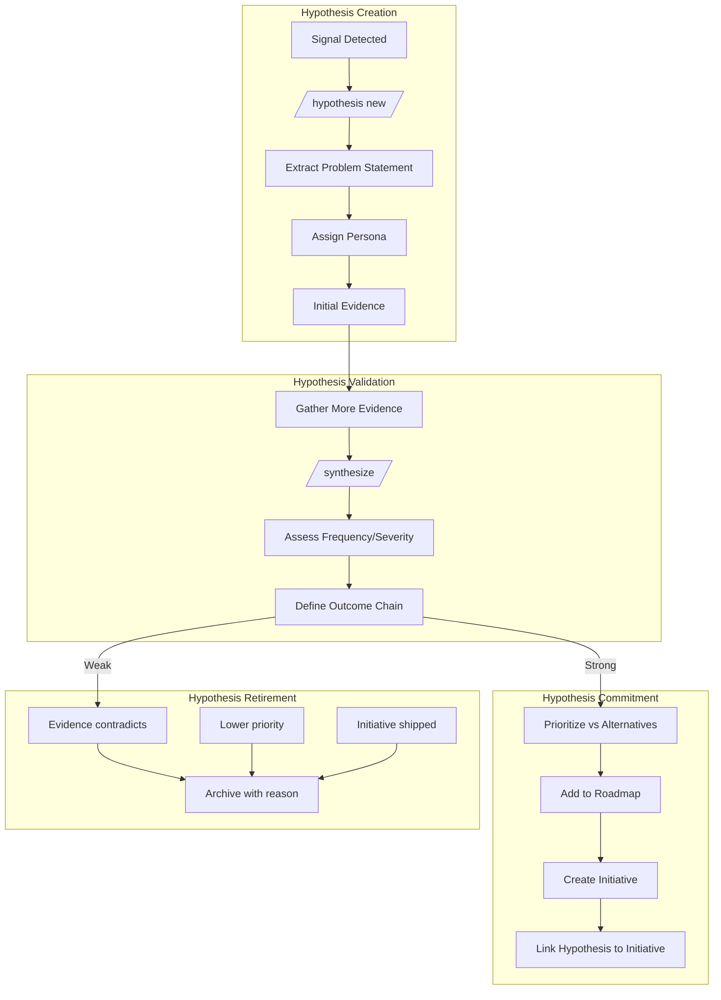
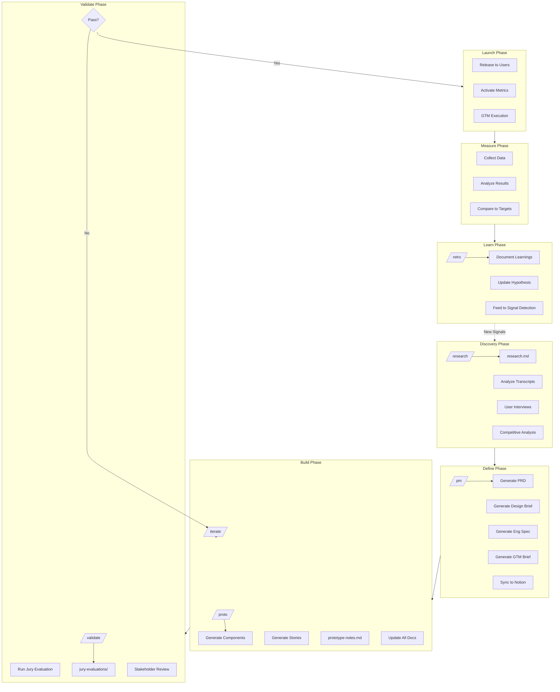
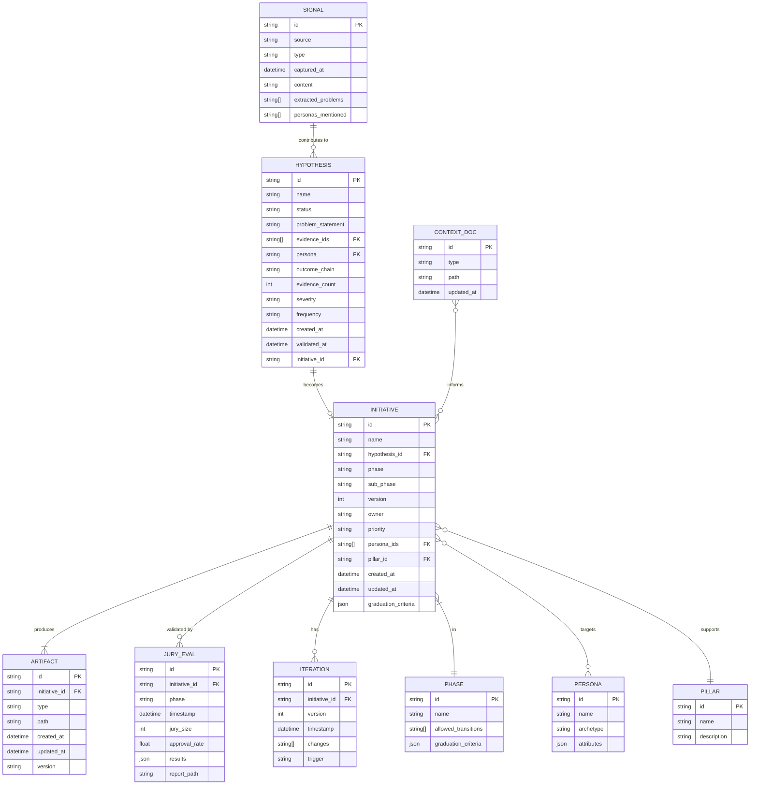

# PM Workspace Data Architecture

**Date:** 2026-01-15  
**Purpose:** Define the data flow, storage locations, and state management for the PM automation system

---

## 1. System Overview

The PM workspace operates as a **signal-to-outcome pipeline** with four major layers:



---

## 2. Data Entities and Storage Locations

### 2.1 Entity Map

| Entity | Description | Storage Location | Format |
|--------|-------------|------------------|--------|
| **Signal** | Raw input from any source | `signals/[type]/` | `.md` or `.json` |
| **Hypothesis** | Unvalidated problem statement | `hypotheses/active/` | `.md` |
| **Validated Problem** | Hypothesis with evidence | `hypotheses/validated/` | `.md` |
| **Initiative** | Committed work item | `initiatives/[name]/` | folder |
| **Research** | Synthesized findings | `initiatives/[name]/research.md` | `.md` |
| **PRD** | Product requirements | `initiatives/[name]/prd.md` | `.md` |
| **Design Brief** | UX specifications | `initiatives/[name]/design-brief.md` | `.md` |
| **Engineering Spec** | Technical spec | `initiatives/[name]/engineering-spec.md` | `.md` |
| **Prototype** | Interactive UI | `elephant-ai/web/.../prototypes/` | `.tsx` |
| **Jury Evaluation** | Validation results | `initiatives/[name]/jury-evaluations/` | `.json/.md` |
| **Phase Metadata** | Lifecycle state | `initiatives/[name]/_meta.json` | `.json` |
| **Context Docs** | Vision, guardrails, personas | `company-context/` | `.md` |

### 2.2 Directory Structure

```
pm-workspace-docs/
├── company-context/                    # STATIC CONTEXT
│   ├── product-vision.md              # Core identity and principles
│   ├── strategic-guardrails.md        # Decision framework
│   ├── personas.md                    # User archetypes
│   ├── integrations.md                # System integrations
│   └── tech-stack.md                  # Technical constraints
│
├── signals/                            # RAW INPUT CAPTURE
│   ├── transcripts/                   # Meeting transcripts
│   │   └── YYYY-MM-DD-[source]-[topic].md
│   ├── tickets/                       # Support tickets
│   │   └── YYYY-MM-DD-[id]-[summary].md
│   ├── issues/                        # Linear/GitHub issues
│   │   └── [source]-[id].md
│   ├── conversations/                 # Slack/email threads
│   │   └── YYYY-MM-DD-[channel]-[topic].md
│   └── _index.json                    # Signal index with metadata
│
├── hypotheses/                         # PROBLEM TRACKING
│   ├── _template.md                   # Hypothesis template
│   ├── active/                        # Unvalidated hypotheses
│   │   └── [hypothesis-name].md
│   ├── validated/                     # Evidence-backed problems
│   │   └── [hypothesis-name].md
│   ├── committed/                     # On roadmap
│   │   └── [hypothesis-name].md       # → links to initiative
│   ├── retired/                       # Invalidated/completed
│   │   └── [hypothesis-name].md
│   └── _index.json                    # Hypothesis index
│
├── initiatives/                        # ACTIVE WORK
│   ├── _template/                     # Initiative template
│   └── [initiative-name]/
│       ├── _meta.json                 # Phase, status, timestamps
│       ├── research.md                # Synthesized research
│       ├── prd.md                     # Requirements
│       ├── design-brief.md            # UX spec
│       ├── engineering-spec.md        # Technical spec
│       ├── gtm-brief.md               # Launch plan
│       ├── decisions.md               # Decision log
│       ├── prototype-notes.md         # Prototype documentation
│       ├── iterations/                # Iteration history
│       │   └── iter-[timestamp]/
│       └── jury-evaluations/          # Validation results
│           └── [phase]-eval-[timestamp].json
│
├── roadmap/                            # AGGREGATED VIEW
│   ├── roadmap.md                     # Auto-generated roadmap
│   ├── by-phase.md                    # Initiatives grouped by phase
│   ├── by-persona.md                  # Initiatives by persona
│   └── stale-items.md                 # Items needing attention
│
├── research/                           # GENERAL RESEARCH
│   ├── competitive/
│   ├── user-interviews/
│   └── [topic]/
│
├── personas/                           # SYNTHETIC PERSONAS
│   ├── archetypes/                    # Base persona definitions
│   ├── generated/                     # Expanded persona pool
│   └── cohorts/                       # Segment definitions
│
└── scripts/                            # AUTOMATION
    ├── jury-system/
    ├── notion-obsidian-sync/
    └── [other automation]/
```

---

## 3. State Machine: Initiative Lifecycle

### 3.1 Phase Definitions



### 3.2 Phase Metadata Schema (`_meta.json`)

```json
{
  "initiative": "hubspot-agent-config-ui",
  "hypothesis_id": "hyp-config-complexity",
  "phase": "build",
  "sub_phase": "iteration",
  "version": 2,
  "created_at": "2026-01-05T10:00:00Z",
  "updated_at": "2026-01-15T14:30:00Z",
  "phase_history": [
    {"phase": "discovery", "entered": "2026-01-05T10:00:00Z", "exited": "2026-01-07T09:00:00Z"},
    {"phase": "define", "entered": "2026-01-07T09:00:00Z", "exited": "2026-01-09T11:00:00Z"},
    {"phase": "build", "entered": "2026-01-09T11:00:00Z", "exited": null}
  ],
  "owner": "tyler",
  "priority": "P1",
  "personas": ["sales-rep", "revops"],
  "pillar": "customer-trust",
  "blockers": [],
  "next_action": "Run jury validation on prototype v2",
  "graduation_criteria": {
    "discovery_to_define": {"evidence_count": 3, "met": true},
    "define_to_build": {"prd_approved": true, "met": true},
    "build_to_validate": {"prototype_complete": true, "met": true},
    "validate_to_launch": {"jury_pass_rate": 70, "current": 65, "met": false}
  },
  "metrics": {
    "days_in_phase": 6,
    "total_iterations": 2,
    "jury_evaluations": 3
  }
}
```

### 3.3 Graduation Criteria by Phase

| From | To | Criteria |
|------|----|----------|
| Signal | Hypothesis | Problem statement extracted, persona identified |
| Hypothesis | Validated | 3+ evidence points, frequency/severity assessed |
| Validated | Committed | Outcome chain defined, prioritized vs alternatives |
| Committed | Discovery | Owner assigned, capacity allocated |
| Discovery | Define | Research complete, user problems documented |
| Define | Build | PRD approved, design brief complete |
| Build | Validate | Prototype covers all states, stories complete |
| Validate | Launch | Jury pass rate ≥70%, stakeholder approval |
| Launch | Measure | Released to users, instrumentation active |
| Measure | Learn | Success metrics evaluated, learnings documented |

---

## 4. Data Flow Diagrams

### 4.1 Signal Capture Flow



### 4.2 Context Assembly Flow



### 4.3 Hypothesis Lifecycle Flow



### 4.4 Initiative Execution Flow



---

## 5. Data Relationships

### 5.1 Entity Relationship Diagram



### 5.2 Information Flow Matrix

| Source | Destination | Trigger | Data Transferred |
|--------|-------------|---------|------------------|
| External → Signal | `signals/` | `/ingest` | Raw content, extracted problems, tags |
| Signal → Hypothesis | `hypotheses/active/` | `/hypothesis new` | Problem statement, initial evidence |
| Signal → Hypothesis | `hypotheses/[status]/` | Auto-match | Additional evidence |
| Hypothesis → Initiative | `initiatives/` | `/hypothesis commit` | Problem, outcome chain, persona |
| Context → Command | In-memory | Any command | Vision, guardrails, personas, existing docs |
| Initiative → PRD | `prd.md` | `/pm` | Requirements, user stories, scope |
| Initiative → Design | `design-brief.md` | `/pm` | Flows, states, patterns |
| Initiative → Prototype | `prototypes/` | `/proto` | React components, stories |
| Prototype → Jury | `jury-evaluations/` | `/validate` | Evaluation results, recommendations |
| Jury → Initiative | `_meta.json`, docs | Auto | Updated phase, iteration triggers |
| Initiative → Roadmap | `roadmap/` | Auto-generated | Aggregated view by phase |
| Launch → Metrics | External | Release | Instrumentation data |
| Metrics → Learn | `decisions.md` | `/retro` | Outcomes, learnings |
| Learn → Signal | `signals/` | Auto | New signals from learnings |

---

## 6. Index Files and Aggregation

### 6.1 Signal Index (`signals/_index.json`)

```json
{
  "last_updated": "2026-01-15T14:30:00Z",
  "total_signals": 47,
  "by_source": {
    "transcript": 23,
    "ticket": 12,
    "linear": 8,
    "slack": 4
  },
  "by_status": {
    "unprocessed": 3,
    "processed": 44
  },
  "recent": [
    {
      "id": "sig-2026-01-15-001",
      "source": "transcript",
      "topic": "Customer Journey Discovery",
      "captured_at": "2026-01-15T10:00:00Z",
      "status": "processed",
      "hypothesis_ids": ["hyp-journey-mapping"]
    }
  ]
}
```

### 6.2 Hypothesis Index (`hypotheses/_index.json`)

```json
{
  "last_updated": "2026-01-15T14:30:00Z",
  "total": 12,
  "by_status": {
    "active": 4,
    "validated": 3,
    "committed": 3,
    "retired": 2
  },
  "hypotheses": [
    {
      "id": "hyp-config-complexity",
      "name": "HubSpot Configuration Complexity",
      "status": "committed",
      "persona": "revops",
      "evidence_count": 7,
      "severity": "high",
      "frequency": "common",
      "initiative_id": "hubspot-agent-config-ui"
    }
  ]
}
```

### 6.3 Roadmap View (`roadmap/roadmap.md`)

Auto-generated from initiative `_meta.json` files:

```markdown
# Product Roadmap

**Generated:** 2026-01-15 14:30

## By Phase

### Discovery (2 initiatives)
| Initiative | Owner | Days | Persona | Priority |
|------------|-------|------|---------|----------|
| customer-journey-map | tyler | 5 | sales-leader | P1 |
| notification-engine | - | 12 | all | P2 |

### Define (1 initiative)
| Initiative | Owner | Days | Persona | Priority |
|------------|-------|------|---------|----------|
| release-lifecycle-process | tyler | 3 | revops | P1 |

### Build (2 initiatives)
| Initiative | Owner | Days | Persona | Priority |
|------------|-------|------|---------|----------|
| hubspot-agent-config-ui | tyler | 6 | revops | P1 |
| universal-signal-tables | - | 8 | sales-rep | P2 |

### Validate (0 initiatives)

### Launched (3 initiatives)
...

## Stale Items (>14 days in phase)
- notification-engine: 12 days in Discovery, no activity
- universal-signal-tables: 8 days in Build, blocked

## By Pillar
...

## By Persona
...
```

---

## 7. Automation Hooks

### 7.1 Event Triggers

| Event | Trigger | Action |
|-------|---------|--------|
| New file in `signals/` | File watcher | Run signal processor, update index |
| Hypothesis evidence_count ≥ 3 | Index update | Suggest validation |
| Initiative enters new phase | `_meta.json` update | Update roadmap, notify |
| Initiative stale > 7 days | Daily cron | Add to stale report |
| Jury pass rate ≥ 70% | Jury completion | Suggest phase graduation |
| PRD updated | File change | Trigger design brief review |
| Prototype committed | Git hook | Run jury pre-validation |

### 7.2 Command → File Mapping

| Command | Reads | Writes |
|---------|-------|--------|
| `/ingest` | Input source | `signals/[type]/`, `signals/_index.json` |
| `/hypothesis new` | `signals/` | `hypotheses/active/`, `hypotheses/_index.json` |
| `/hypothesis validate` | `hypotheses/active/` | `hypotheses/validated/`, index |
| `/hypothesis commit` | `hypotheses/validated/` | `hypotheses/committed/`, `initiatives/`, index |
| `/status` | `_meta.json`, indexes | stdout |
| `/research` | Context docs, signals | `research.md`, Notion |
| `/pm` | Context, research | `prd.md`, `design-brief.md`, `engineering-spec.md`, `gtm-brief.md`, Notion |
| `/proto` | PRD, design-brief | `prototypes/`, `prototype-notes.md` |
| `/iterate` | Feedback, existing docs | Updated docs, new prototype version |
| `/validate` | Prototype, personas | `jury-evaluations/`, `_meta.json` |
| `/roadmap` | All `_meta.json` | `roadmap/*.md` |
| `/synthesize` | `signals/`, `hypotheses/` | Synthesis report |
| `/retro` | Metrics, initiative docs | `decisions.md`, new signals |

---

## 8. Implementation Notes

### 8.1 Key Design Decisions

1. **File-based over database** - All state in git-tracked markdown/JSON for transparency and versioning
2. **Indexes for performance** - JSON index files prevent scanning all files for aggregation
3. **Phase in metadata** - Phase is stored in `_meta.json`, not inferred from file presence
4. **Hypothesis-first** - No initiative without a linked hypothesis (enforced)
5. **Context auto-assembly** - Commands don't require manual `@` references
6. **Graduation gates** - Phase transitions require explicit criteria, not just time

### 8.2 Migration Path

For existing initiatives without `_meta.json`:
1. Run migration script to infer phase from existing files
2. Create `_meta.json` with inferred state
3. Create placeholder hypothesis if none exists
4. Update indexes

### 8.3 Notion Sync Strategy

- **One-way for read**: Pull signals from Notion (transcripts, feedback)
- **One-way for write**: Push initiative docs to Notion (PRD, specs)
- **Bidirectional**: Project status synced both ways
- **Source of truth**: Local files are authoritative; Notion is a view

---

## 9. Summary: Where Does Each Thing Live?

| Information Type | Location | Format | Updated By |
|------------------|----------|--------|------------|
| Company vision and strategy | `company-context/` | `.md` | Manual (rare) |
| Raw customer input | `signals/` | `.md` | `/ingest` |
| Problem hypotheses | `hypotheses/` | `.md` | `/hypothesis` |
| Active work items | `initiatives/[name]/` | folder | PM commands |
| Work item status | `initiatives/[name]/_meta.json` | `.json` | All commands |
| Research findings | `initiatives/[name]/research.md` | `.md` | `/research` |
| Requirements | `initiatives/[name]/prd.md` | `.md` | `/pm` |
| UI specifications | `initiatives/[name]/design-brief.md` | `.md` | `/pm` |
| Technical specs | `initiatives/[name]/engineering-spec.md` | `.md` | `/pm` |
| Prototype code | `elephant-ai/.../prototypes/` | `.tsx` | `/proto` |
| Validation results | `initiatives/[name]/jury-evaluations/` | `.json/.md` | `/validate` |
| Aggregated roadmap | `roadmap/` | `.md` | Auto-generated |
| Synthetic personas | `personas/` | `.json` | Scripts |
| Decision log | `initiatives/[name]/decisions.md` | `.md` | Manual + `/retro` |

---

*This architecture ensures every piece of information has a clear home, flows through defined paths, and supports tracking work through its entire lifecycle.*
